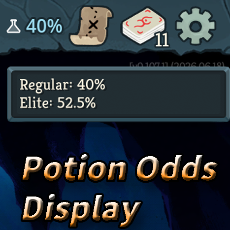

# Potion Odds Top Bar Display

A UI-only mod for **Slay the Spire 2** that shows the current regular-enemy
potion reward chance in the top bar. Hover over the display to see both the
regular and elite-enemy chances.



## Features

- Shows the regular potion reward chance in the top bar.
- Changes the displayed number through a rainbow palette in 10% steps.
- Shows regular and elite potion reward chances in an STS2-style hover tip.
- Uses the game's current language setting for English and Japanese labels.
- Does not alter gameplay or potion reward calculations.

## Installation

Install it from the
[Steam Workshop](https://steamcommunity.com/sharedfiles/filedetails/?id=3747927344).

## Requirements

- Slay the Spire 2 `v0.107.1` or later

## Building

Close Slay the Spire 2, then run:

```powershell
dotnet build -c Release
```

The project builds the DLL and copies it with the mod manifest to the game's
`mods/PotionOddsTopBarDisplay` directory.

## Workshop upload

The official
[STS2 Mod Uploader](https://github.com/megacrit/sts2-mod-uploader) can upload
the files in the `workshop` directory:

```powershell
ModUploader.exe upload -w workshop
```

The uploader-specific `mod_id.txt`, logs, packaged DLL, and editable preview
source are intentionally excluded from Git.

## License

[MIT](LICENSE)
